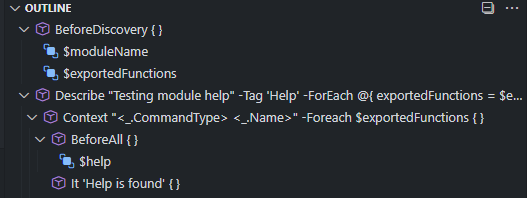
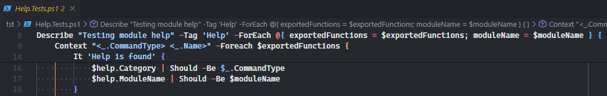
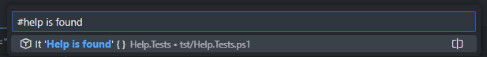

Using Visual Studio Code with the latest [PowerShell extension](https://marketplace.visualstudio.com/items?itemName=ms-vscode.PowerShell) is a great combination for writing PowerShell code. The extenstion even includes a few Pester-specific features to improve the way you write, run and debug Pester tests.

### Code lens

With the `Pester: Code Lens` setting enabled, VSCode will show `Run tests` or `Debug tests` links above your Pester blocks for quick execution. Starting with Pester 5 this also works on individual tests. You can even run tests that are marked as skipped by running them individually.

To enable the improved code lens for Pester 5 you need to disable the "Use Legacy Code Lens" setting which is enabled by default.

1. In Visual Studio Code, open **File | Preferences | Settings** (<kbd>⌘/Ctrl</kbd> + <kbd>,</kbd>)
2. In the **Settings** window, navigate to the **Extensions | PowerShell** section.
3. Uncheck the **Pester: Use Legacy Code Lens** checkbox.
4. Close the **Settings** window.

### Output verbosity

You can control the output verbosity level in VSCode output, or let it inherit from PesterPreference.

### Navigation

Pester-blocks are recognized by the PowerShell-extenstion to simplify navigation in your test files. You can see the strcuture of your Pester file using the Outline view.

Your current location in nested blocks are shown in the breadcrumbs and sticky scroll features:

`Context`, `Describe` and `It` blocks are all searchable using Go to symbol commands

