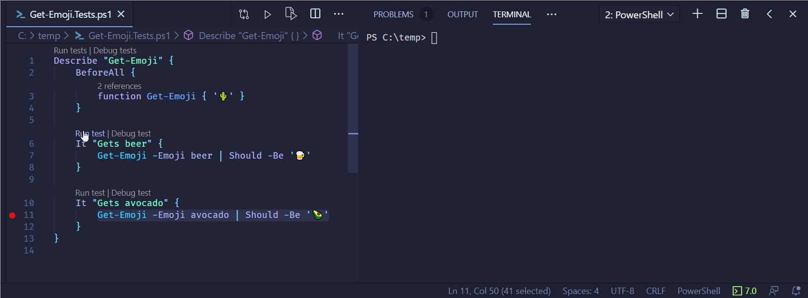
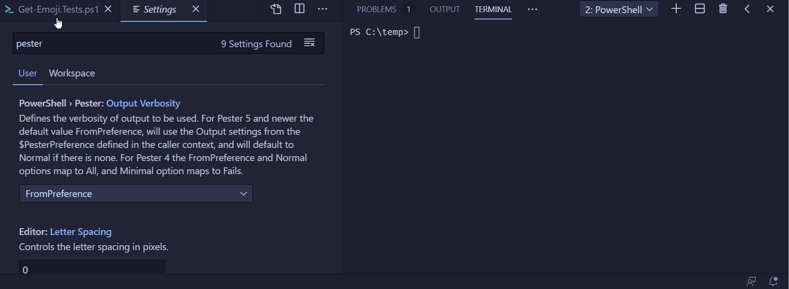
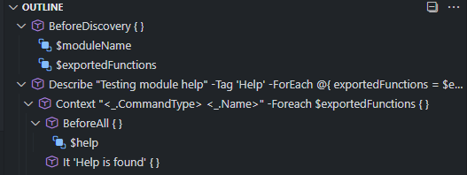
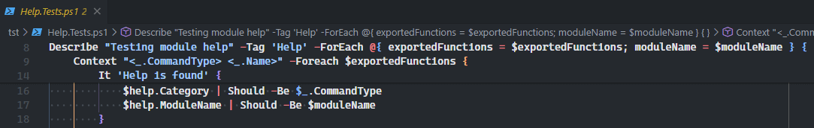
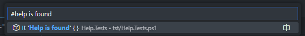

Using Visual Studio Code with the latest [PowerShell extension](https://marketplace.visualstudio.com/items?itemName=ms-vscode.PowerShell) provides a great experience for writing PowerShell code. The extension even includes Pester-specific features to improve the way you write, run and debug tests.

### Code lens

The editor shows `Run tests` or `Debug tests` links above your Pester blocks for quick execution of `Describe` and `Context` blocks. Starting with Pester 5 this also works on individual tests. You can even run tests that are marked as skipped by running them individually.

To enable the improved code lens for Pester 5 you need to disable the "Use Legacy Code Lens" setting which is enabled by default.

1. In Visual Studio Code, open **File | Preferences | Settings** (<kbd>⌘/Ctrl</kbd> + <kbd>,</kbd>)
2. In the **Settings** window, navigate to the **Extensions | PowerShell** section.
3. Uncheck the **Pester: Use Legacy Code Lens** checkbox.
4. Make sure **Pester: Code Lens** is checked (default).
5. Close the **Settings** window.

### Output verbosity

You can control the output verbosity level in VSCode output, or let it inherit from PesterPreference.

### Navigation

Pester-blocks are recognized as symbols to simplify navigation in multiple ways:

- The Outline panel shows an overview of your Pester-blocks. 
  
- The current location in nested blocks are shown in breadcrumbs and sticky scroll. 
  
- `Context`, `Describe` and `It` blocks are all searchable using "Go to symbol" commands. 
  
