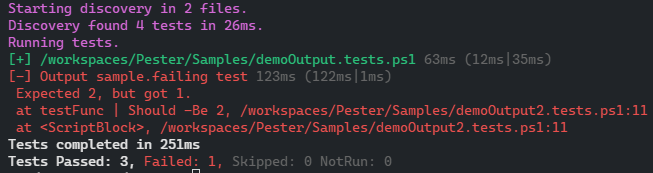
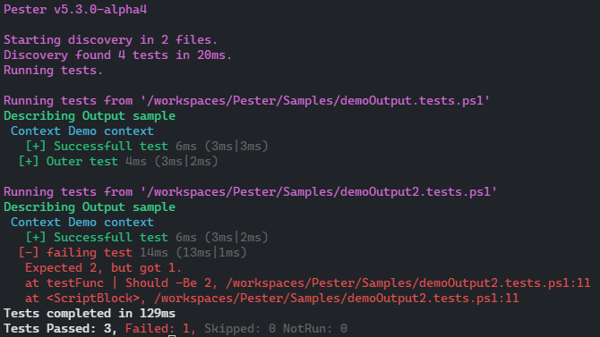
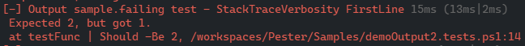
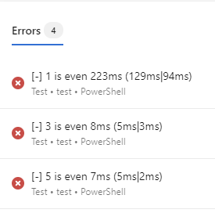
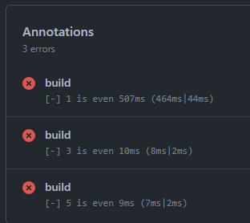
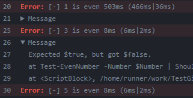

Pester offers multiple options to customize the console output to your preference. These settings are available in the Output-section of PesterConfiguration.

```powershell
$conf = New-PesterConfiguration
$conf.Output

Verbosity           : The verbosity of output, options are None, Normal, Detailed and Diagnostic. (Normal, default: Normal)
StackTraceVerbosity : The verbosity of stacktrace output, options are None, FirstLine, Filtered and Full. (Filtered, default: Filtered)
CIFormat            : The CI format of error output in build logs, options are None, Auto, AzureDevops and GithubActions. (Auto, default: Auto)
RenderMode          : The mode used to render console output, options are Auto, Ansi, ConsoleColor and Plaintext. (Auto, default: Auto)
```

This page focuses on the general options available for all users. See [VSCode](./vscode) for settings and features specific to using Pester with VSCode.

### Verbosity

This option controls the general level of console output. Pester v5 supports the following levels:

- **None**: No console output is shown. Typically used in combination with `Run.PassThru / -PassThru` to do custom post-processing of the results.
- **Normal (default)**: Focus on successful containers and failed tests/blocks. Shows basic discovery information and the summary of all tests.<br/>

- **Detailed**: Similar to Normal, but this level shows all blocks and tests, including successful.<br/>

- **Diagnostic**: Very verbose, but useful when troubleshooting tests. This level behaves like Detailed, but also enables debug-messages. It enforces common debug message categories as a minimum, but additional levels can be enabled by appending to the list in `Debug.WriteDebugMessagesFrom`.<br/>


### StackTraceVerbosity

**New in Pester 5.3!**
When an error is shown due to a failed setup or test, a stacktrace is included to help you identify where the problem occured. Users might not care much about this while developers need it to identify and fix any issues.
This option lets you control how much of the stacktrace that will be printed using one of the following levels:

- **None**: No stacktrace is shown, only the error message.<br/>

- **FirstLine**: Only show the first line of the stacktrace. This is typically the line in your failing tests.<br/>

- **Filtered (default)**: Shows stacktrace related to your code. Filters out lines related to Pester-runtime.<br/>

- **Full**: Shows unfiltered stacktrace including calls made by Pester-runtime. Mostly used for troubleshooting. This is equal to the option `Debug.ShowFullErrors = $true` used prior to Pester v5.3.<br/>


:::tip Error details are always available in the result-object
The result-object returned from `Run.PassThru / -PassThru` includes a `ErrorRecord`-property in all blocks/tests with full stacktrace and more, even if you've limited the console output using the options above.
:::

### CIFormat

**New in Pester 5.3!**
Pester supports CI-specific output syntaxes to highlight, log and navigate to errors in your tests for a few popular CI systems. This options lets your control how this behavior should work. The following levels are currently supported:

- **None**: Disable all CI-specific syntax. Error messages are presented in the format you're familiar with.
- **Auto (default)**: Automatically enables CI-specific format when Pester detects that it runs in a supported CI system. Will fallback to same output as None.
- **AzureDevops**: Enables Azure Devops-specific format to log errors and display the error messages in red.
- **GithubActions**: Enables Github Actions-specific format to log errors and display the error message in red. Error message and stacktrace are grouped.

#### Azure Devops
In Azure Devops, the following features are enabled:
- Errors are logged and shown in the run summary. Clicking on a error will send you to the related lines in the build log.<br/>

- Error messages are highlighted with a prefix and colorized.<br/>


Auto-detection works by checking if `TF_BUILD` environment variable is equal to `True`.

#### Github Actions
In Github Actions, the following features are enabled:
- Errors will be highlighted in the run summary.<br/>

- Error title will be highlighted in red. The remaining error message and stacktrace is placed in a expandable group to clean up the logs.<br/>


Auto-detection works by checking if `GITHUB_ACTIONS` environment variable is equal to `True`.

### RenderMode

**New in Pester 5.4!**
Pester supports multiple render modes for console output, including ANSI escape sequences which enables colors in CI-logs. The currently supported modes are:

- **Auto (default)**: Automatically enables the recommended mode using the following rules:
  - `Plaintext` when environment variable [`NO_COLOR`](https://no-color.org/) is set.
  - `ANSI` when a supported PowerShell host is being used.
  - `ConsoleColor` used as fallback.
- **ANSI**: Render using ANSI escape sequences. Colors are shown in ANSI-supported console hosts, redirected output, CI-logs etc.
- **ConsoleColor**: Uses default `Write-Host` behavior. Colors are shown in console but not in CI, redirected output etc. Same mode is used prior to Pester 5.4.
- **Plaintext**: Render output without colors.

:::note Using ANSI with PowerShell 3 and 4
ANSI support is auto-detected using the property `$host.UI.SupportsVirtualTerminal` which was introduced in PowerShell 5. If you are running PowerShell 3 or 4 in a known supported host or CI, you need to enable it explictly using `Output.RenderMode = 'Ansi'`.
:::
